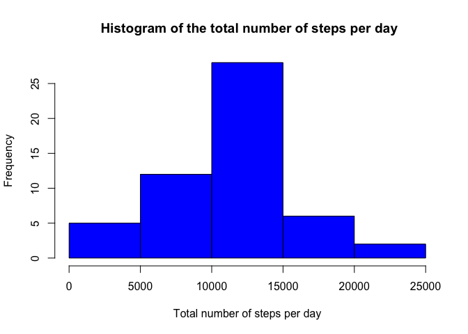
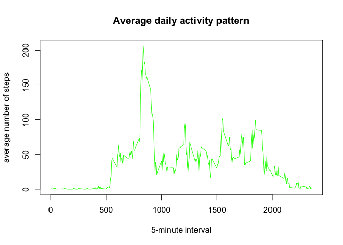
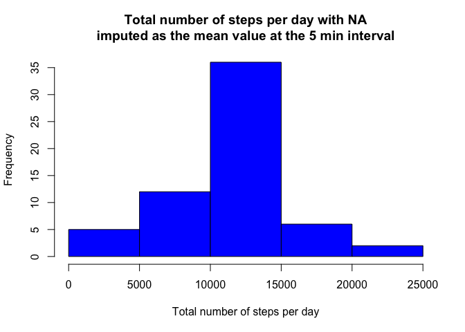
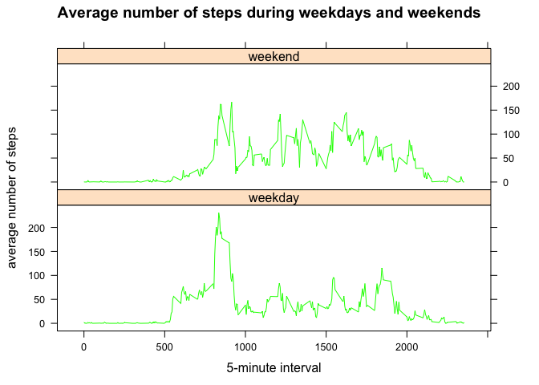

## Loading and preprocessing the data


```r
library(dplyr)
library(lattice)
unzip("activity.zip")
data<-read.csv("activity.csv" , stringsAsFactors = FALSE)
data$date<-as.Date(data$date)
```

## What is mean total number of steps taken per day?


We first group the data per day and calculate the total number of steps taken every day using the summarise function of the dplyr library. 


```r
perday<- data %>%
         group_by(date) %>%
         summarise(totalsteps = sum(steps))
```


First we can have a look at the histogram of the total number of steps taken each day.


```r
 hist(perday$totalsteps,
        main = " Histogram of the total number of steps per day",
       xlab = "Total number of steps per day",
      col = "blue"
        )
```

<!-- -->

The mean total number of steps taken per day is :


```r
mean(perday$totalsteps,na.rm = TRUE)
```

```
## [1] 10766.19
```

The median equals :

```r
median(perday$totalsteps,na.rm = TRUE)
```

```
## [1] 10765
```

## What is the average daily activity pattern?


To analyze the average daily activity pattern, we group the data by the 5 min interval variable and evaluate the mean number of steps via the summary function.


```r
perint<-group_by(data,interval) %>%
        summarize(meansteps = mean(steps,na.rm=TRUE))
```

The average daily activity pattern evolves as follows:

```r
with(perint,
     plot(interval,meansteps,
          type='l',
          xlab = "5-minute interval",
          ylab = "average number of steps",
          main = "Average daily activity pattern",
          col = "green"     
          )
     )
```

<!-- -->


On average across all the days, the maximum number of steps occurs in the 5 min interval given by:


```r
perint$interval[which.max(perint$meansteps)]
```

```
## [1] 835
```


## Imputing missing values

For a  number of days/intervals, there are missing values which may introduce bias into some calculations or summaries of the data. 
The total number of missing values in the dataset is:

```r
sum(is.na(data))
```

```
## [1] 2304
```

We choose to impute the missing values in the dataset
with the mean value for the corresponding 5-minute interval.

To do so we first determine the vector of row indices at which missing values occur then extract the day averaged values at the corresponding 5 min intervals.


```r
na.rows.ind<-which(is.na(data$steps))
values<-left_join(data[na.rows.ind,],perint,by="interval")
```

A new vector containing the entire number of steps data with NA values imputed are then calculated and used to obtain a new dataset without missing values.


```r
newvalues<-replace(data$steps,na.rows.ind,values$meansteps)
datanew<- data %>% mutate(steps = newvalues)
```

We can then evaluate again the total number of steps taken each day with the new imputed dataset and look at changes in the histogram: 


```r
perdaynew<-datanew %>%
        group_by(date) %>%
        summarise(totalsteps = sum(steps))
```

```
## `summarise()` ungrouping output (override with `.groups` argument)
```

```r
hist(perdaynew$totalsteps,
     main = "Total number of steps per day with NA\nimputed as the mean value at the 5 min interval",
     xlab = "Total number of steps per day",
     col = "blue"
)
```

<!-- -->

With this imputing method the mean,


```r
mean(perdaynew$totalsteps)
```

```
## [1] 10766.19
```
remains unchanged, whereas the median total number of steps per day nows equals the mean value exactly.


```r
median(perdaynew$totalsteps)
```

```
## [1] 10766.19
```


## Are there differences in activity patterns between weekdays and weekends?

To compare the activity patterns during weekdays and weekends, we create a new factor variable in the dataset with two level labels – “weekday” and “weekend”.


```r
datanew$wday<-weekdays(datanew$date)
wdlevels<-unique(datanew$wday)
wdlabels<-c(rep("weekday",5),rep("weekend",2))
datanew$wday=factor(datanew$wday,levels=wdlevels,labels=wdlabels)
```

One can then calculate the average number of steps grouped by this new factor variable and compare their evolution in a plot. 


```r
bywday<-datanew %>%
        group_by(interval,wday) %>%
        summarise(nsteps=mean(steps))

xyplot(nsteps ~ interval|wday, data = bywday,
               type = "l",
               layout = c(1,2,1),
               xlab = "5-minute interval",
               ylab = "average number of steps",
               main = "Average number of steps during weekdays and weekends",
               col = "green"       
       )
```

<!-- -->

As expected on can see that activities start earlier in morning during the weekdays than during weekends. During weekends the activity signal extend a little later in the evening. While during weekends activtities remain relatively constant during the day, activity intensity display more abrupt variations and a prononced peak (lunch time ?) during the weekdays.  
